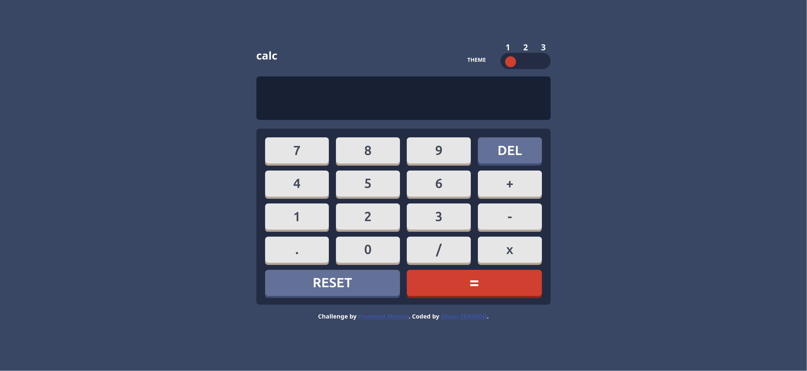
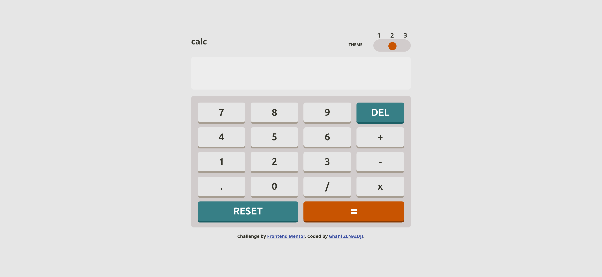
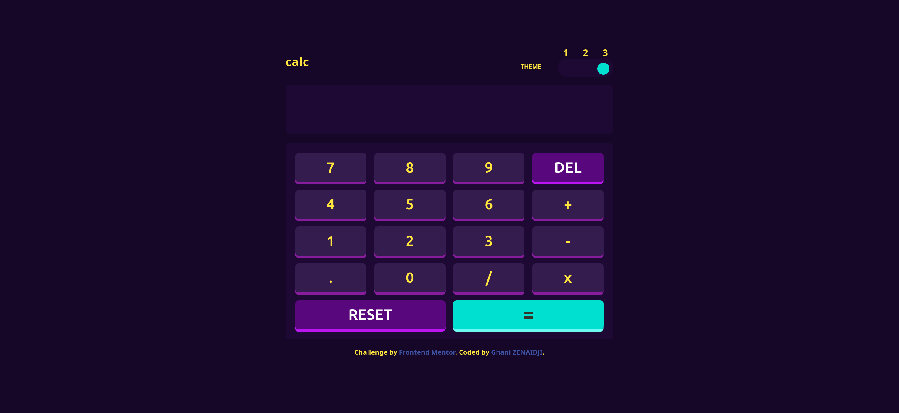
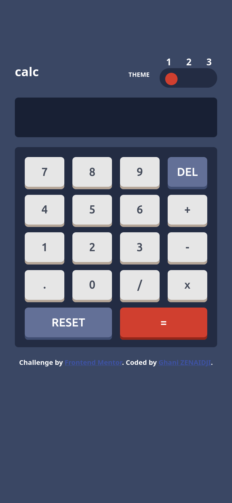
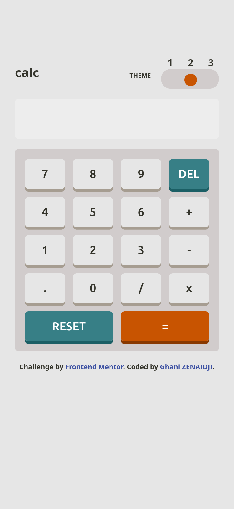
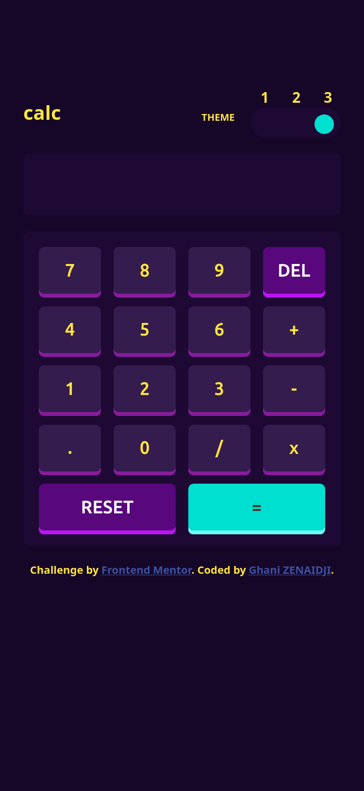

# Frontend Mentor - Calculator app solution

This is a solution to the [Calculator app challenge on Frontend Mentor](https://www.frontendmentor.io/challenges/calculator-app-9lteq5N29). Frontend Mentor challenges help you improve your coding skills by building realistic projects.

## Table of contents

- [Overview](#overview)
  - [The challenge](#the-challenge)
  - [Screenshot](#screenshot)
  - [Links](#links)
- [My process](#my-process)
  - [Built with](#built-with)
  - [Deployment](#deployment)
  - [What I learned](#what-i-learned)
  - [Useful resources](#useful-resources)
- [Author](#author)

## Overview

### The challenge

Users should be able to:

- See the size of the elements adjust based on their device's screen size
- Perform mathmatical operations like addition, subtraction, multiplication, and division
- Adjust the color theme based on their preference
- **Bonus**: Have their initial theme preference checked using `prefers-color-scheme` and have any additional changes saved in the browser

### Screenshot

#### Desktop

<p align="center">
  
  
  
</p>

#### Mobile

<p align="center">
  
  
  
</p>

### Links

- Solution URL: [Github repository](https://github.com/Zenaidji/calculator-App)
- Live Site URL: [Calculator app](https://zenaidji.github.io/calculator-App/)

## My process

### Built with

- Semantic HTML5 markup
- CSS custom properties
- Flexbox
- CSS Grid
- [React](https://reactjs.org/) – JavaScript library used with Vite

### Deployment

This project is deployed using **GitHub Pages** with the `gh-pages` package.

#### Configuration

1. **Install the `gh-pages` dependency**

   ```bash
   npm install gh-pages --save-dev
   ```

2. **Add the following lines to your `package.json`:**

   ```json
   {
     "scripts": {
       "predeploy": "npm run build",
       "deploy": "gh-pages -d dist"
     }
   }
   ```

#### Build and deploy

to deploy the app run the following command

```bash
npm run deploy
```

The page will be available at `https://Zenaidji.github.io/yourRepository/`.  
For example: [https://Zenaidji.github.io/calculator-App/](https://Zenaidji.github.io/calculator-App/)

### What I learned

I learned how to use media queries and create CSS variables.

### Useful resources

- [Vite](https://vite.dev/) – Fast and modern build tool for React projects.
- [React](https://react.dev/) – Powerful JavaScript library for building user interfaces.

## Author

- Website - [Ghani ](https://ovac.cloud)
- Frontend Mentor - [@Zenaidji](https://www.frontendmentor.io/profile/Zenaidji)
